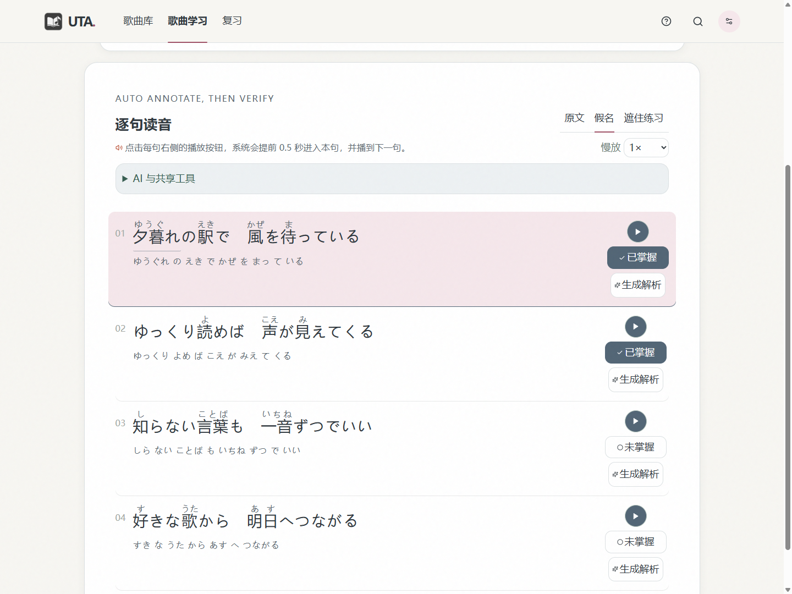
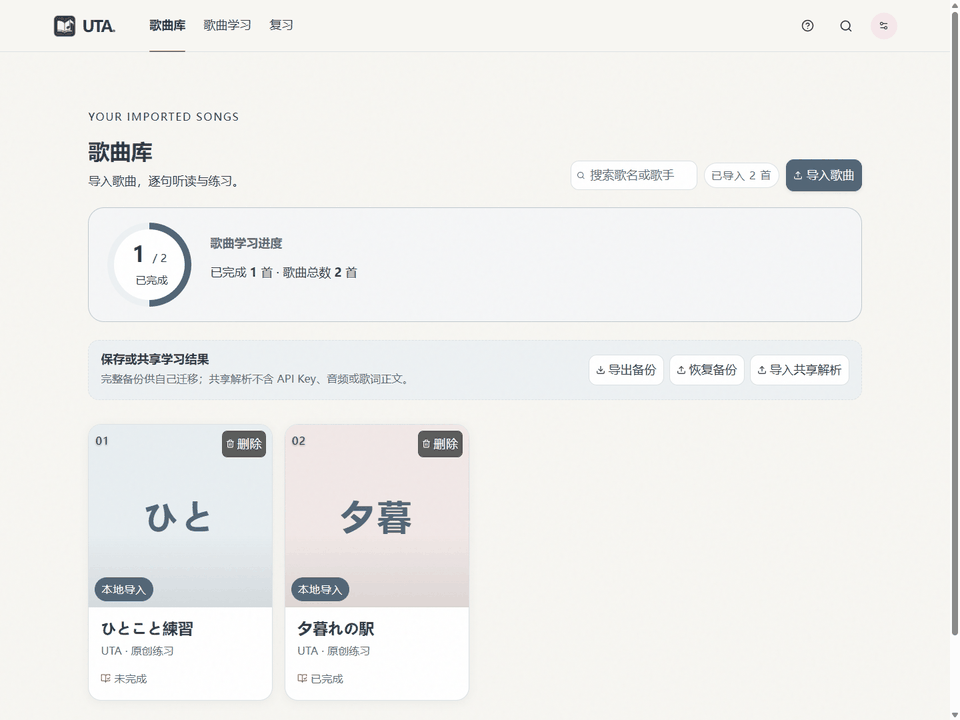
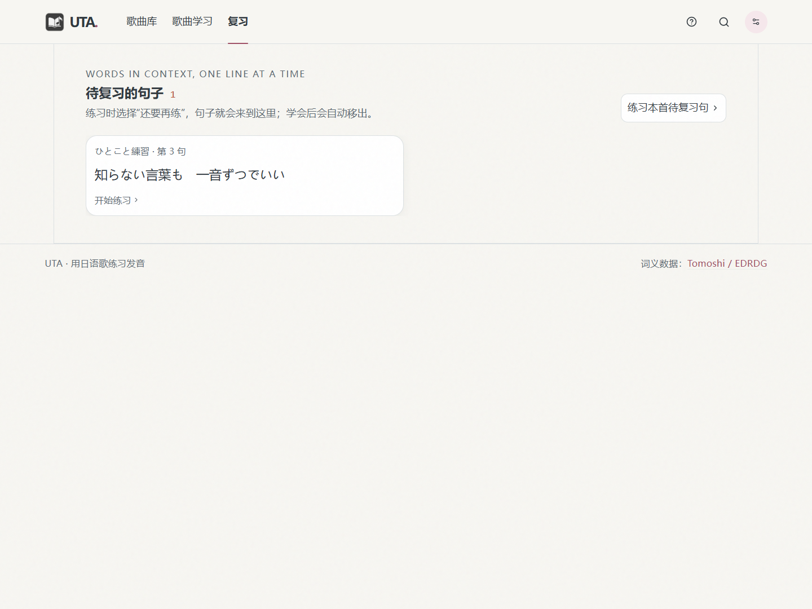

# UTA · 用日语歌曲学日语


把喜欢的日语歌变成逐句学习材料：听一句、看假名、查词，再练到熟悉。

**Windows 10/11 x64 · 本地优先 · 基本功能无需 API Key**

[下载 Windows 安装包](https://github.com/CosmerHomura/Japanese-song-learning-website/releases/latest) · [English](README.en.md) · [反馈问题](https://github.com/CosmerHomura/Japanese-song-learning-website/issues/new/choose)



## 看看它如何使用



演示使用项目内的原创练习文字与示例进度，不包含商业歌曲或用户数据。这是无声界面演示；内置文字示例没有音频，逐句播放需导入自己的音频。

## 可以做什么

- 从歌曲库导入 LRC 与 MP3、M4A、WAV、OGG 或 WebM 音频，预览并修改歌词、时间戳、译文和封面。
- 按句播放、慢放和练习；标记已掌握或加入复习，查看歌曲与逐句学习进度。
- 樱花、暖纸、清新绿或夜读主题，自定义字体大小；页面横向切换，动效可关闭或跟随系统。
- 本地生成读音，可在设置中切换平假名／罗马音显示，并查询可选的日中词典；读音或分词不准确时可手动修正、合并或拆分，再重新查词。点击待确认读音提示可直接定位到词并校对，已修正的词不再计入提示。
- 按需使用 AI 检查读音、分词或解释语境。用户确认后才应用建议；AI 供应商、模型和本机 Key 在设置中管理，费用以人民币估算。
- 导出个人备份，或导出不含音频、API Key 和歌词正文的 `.uta-analysis` 共享解析。共享前仍需确认内容的版权与隐私。

## 开始使用

1. 打开 [最新发布页](https://github.com/CosmerHomura/Japanese-song-learning-website/releases/latest)，下载 `UTA-Setup-<版本>.exe` 并安装。无需安装 Python 或 Node.js；`latest.yml` 和 `.blockmap` 是更新文件，不必手动下载。
2. 在 **歌曲库 → 导入歌曲** 中选择自己的音频和匹配的 LRC 歌词。
3. 进入 **歌曲学习**，逐句听读、查词与校对；没把握的句子加入 **复习**。

安装时会创建桌面快捷方式。正式安装版支持在 **设置 → 关于与更新** 检查更新、下载并确认重启安装。当前安装包未进行数字签名，Windows 可能显示安全提示，请核实下载来源。

词典与 AI 均为可选：不安装词典、不填写 Key，也能使用基本注音。首次启动可选择安装推荐的 Tomoshi 日中词典；之后在 **设置 → 本地词典** 下载、取消下载或导入兼容数据库。

<details>
<summary>歌曲库与复习界面</summary>




</details>

## 常见问题

### LRC 是什么？必须有吗？

导入歌曲时，LRC 必须包含与音频匹配的时间戳，例如：

```lrc
[00:12.40]夏の空を見上げる
[00:16.20]君に言葉を届けたい
```

LRC 是歌词时间轴，不包含音频；普通 TXT 改名为 `.lrc` 并不会自动产生时间戳。导入器支持 UTF-8、GBK／GB18030 编码。切换设备前，请在歌曲库导出个人备份。

### 词典下载慢怎么办？

可从 [Tomoshi 发布页](https://github.com/tomoshi-app/tomoshi-dict-data/releases) 手动获取 `tomoshi-dict-open.db.zst`，再通过 **设置 → 本地词典 → 上传本地词典** 导入。也支持符合应用数据表要求的 `.db`、`.sqlite`、`.sqlite3` 文件。

### 自动读音或分词不对怎么办？

点击对应词在右侧校对读音；拖选相邻词调整分词边界，合并或拆分后重新查询词典。也可以主动请求 AI 检查，但自动结果仍需核对。

### 使用需要付费吗？

本地注音、词典查询与学习功能不需要 AI 付费接口。启用 AI 时，需要自己的供应商 API Key，并按供应商规则计费。

## 隐私与费用

歌词、音频、学习进度和本机 Key 默认保存在本机。Windows 桌面端 Key 使用当前用户的系统加密保护，不进入学习备份。自动注音和词典查询在本机执行；只有用户主动请求 AI 解析/校对时，所需歌词上下文才会发给所选供应商。刷新账户可用模型时，会用 Key 向该供应商鉴权；公开模型与价格目录不携带 Key。远程 API 必须使用 HTTPS，带 Key 的请求不会自动跟随重定向。查询封面时，歌名和歌手名可能发送给 Apple Music。AI 人民币费用是参考价格估算，最终以供应商账单为准。

正式构建不包含开发目录中的本地歌词或音频。网页版的“记住 Key”使用浏览器本地存储，不具备桌面端的系统加密保护；请勿在共用设备上启用。

项目不提供受版权保护的歌曲、歌词或音频下载。请只导入、分享你有权使用的内容；完整个人备份可能包含原始音频，不适合公开传播。

## 致谢

- 本仓库 fork 自 [meilawiet/Japanese-song-learning-website](https://github.com/meilawiet/Japanese-song-learning-website)。桌面端和新增学习功能由本 fork 扩展，并非原作者的官方发行版。
- 日语分词与读音：SudachiPy / SudachiDict Core。
- 可选日中词典：Tomoshi Dictionary Open Data Layer；见 [第三方数据声明](THIRD_PARTY_DATA_NOTICES.md)。

项目使用 [MIT 许可证](LICENSE)，第三方数据遵循各自许可。

## 反馈与参与

欢迎通过 [Issues](https://github.com/CosmerHomura/Japanese-song-learning-website/issues/new/choose) 报告问题或提出建议。请附上应用版本、复现步骤与必要截图，不要上传 API Key、完整备份或无权分享的歌曲。

从源码运行或构建，请查看 [开发文档](docs/development.md)。
